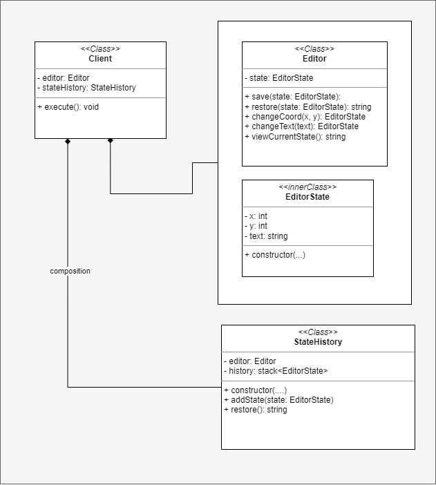
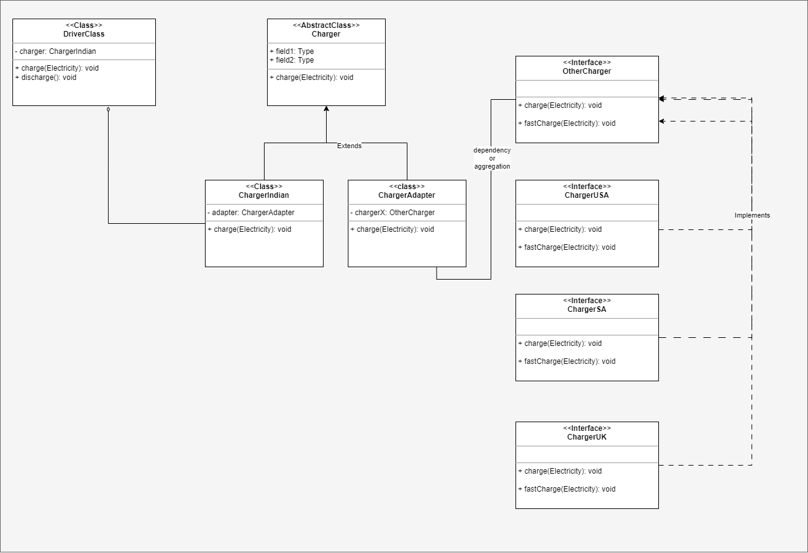
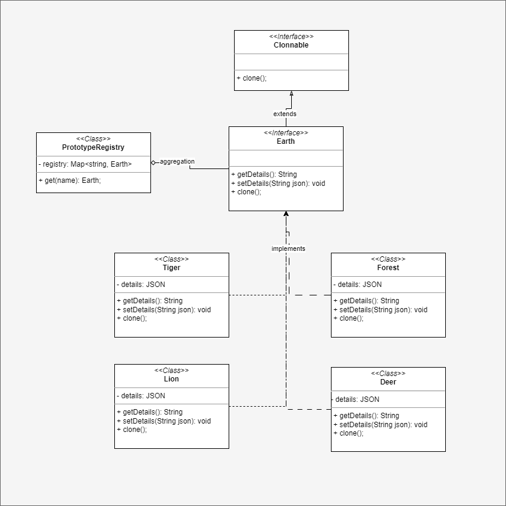
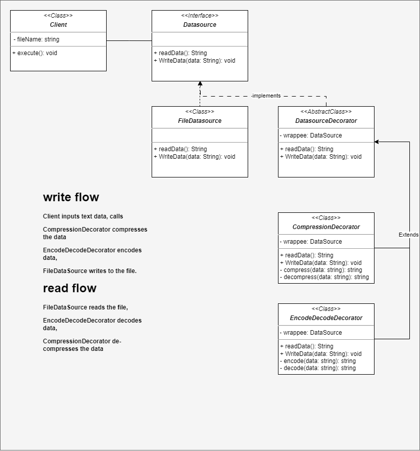
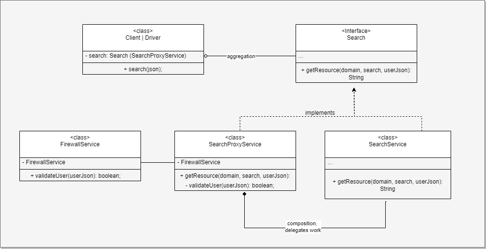

# Design Patterns
In this repository I have covered 21 design pattern of all 3 types creational, behavioural, structural
in a very unique way so you can relate to the realtime analogy of the examples used to implement each
pattern.
### status: code implementation: DONE, readme.md : Work in progress.

## MEMENTO DESIGN PATTERN
It is a Behavioural design pattern . You can use this pattern when you need to store state of a
application and provide any operation on those state like undo.

### EXAMPLE
Let's say you are building a text editor app, obviously you need to provide undo operation feature,
so you can revert back N number of times and continue editing. And create new state on every text
edit.

### UML DIAGRAM

## ADAPTER DESIGN PATTERN
It is a Structural design pattern used to connect the client class/interface with a
compatible/incompatible interface.

### EXAMPLE
Let's say you travel abroad with your regular charger, but the countries abroad use different sockets
with different voltage and current. Now to charge your device you need an adapter with socket
that supports your devices and plug that is compatible with different socket types.

### UML DIAGRAM

## PROTOTYPE DESIGN PATTERN
It is a Creational design pattern used to create clone of the existing object. So that you are
free from the hassle of copying every class member's object values and without clone
accessing private member becomes difficult prototype solves this problem,
helps you get clones with different object configuration.

### EXAMPLE
Let's say you are making a study on living organisms on Earth, you wish get information of
those organism and modify certain information regarding that organism and submit those details
for modification to the governing body without altering the actual object.

### UML DIAGRAM

## DECORATOR DESIGN PATTERN
It is a Structural design pattern used to provision multiple operations apart from the basic operation on a
raw object.

### EXAMPLE
Let's say you have a datasource, that can read a file and write text to a file. Now you need to add features
that compresses the text and also encodes it in base64 before storing in file. And also be able to reverse the
process to enable reading.

### UML DIAGRAM

# PROXY DESIGN PATTERN
It is a structural design pattern used to provide a proxy for a service class, so that it can control the flow of information in and out of the actual service class. And aslo
to maintain a stable client functionality even when changes are made to the actual service class. 

proxy service class usecases include caching, access control

## EXAMPLE 
Let's say you have a Search tool, which searches for text from the domain you specify. But only to the known users.
to achieve this, you create a SearchProxyService, that composes firewall service, which authorizes the user access to the 
search service. The proxy service simply uses firewall to authorize the user request and responds accordingly.

## UML DIAGRAM

