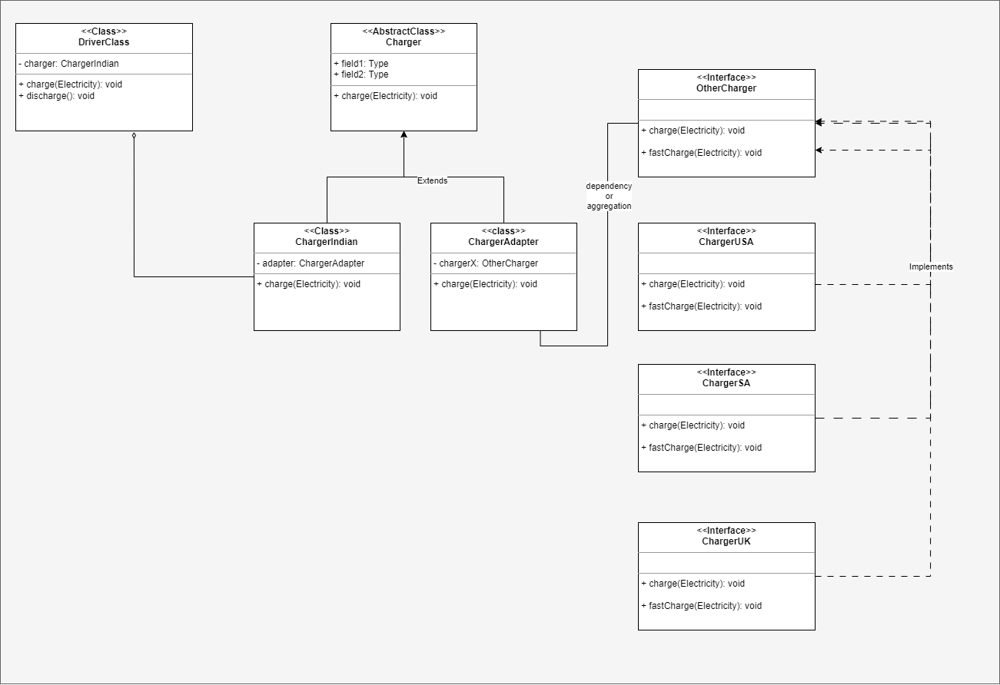

# ADAPTER DESIGN PATTERN
It is a Structural design pattern used to connect the client class/interface with a 
compatible/incompatible interface.

## EXAMPLE
Let's say you travel abroad with your regular charger, but the countries abroad use different sockets
with different voltage and current. Now to charge your device you need an adapter with socket 
that supports your devices and plug that is compatible with different socket types.

## UML DIAGRAM

