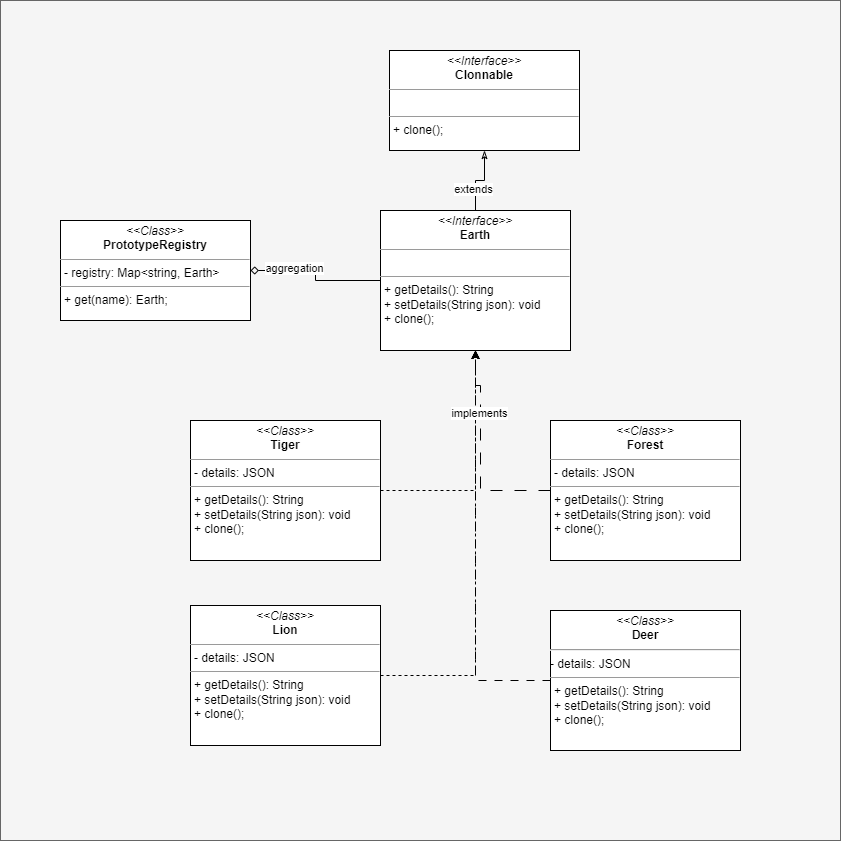

# PROTOTYPE DESIGN PATTERN
It is a Creational design pattern used to create clone of the existing object. So that you are
free from the hassle of copying every class member's object values and without clone
accessing private member becomes difficult prototype solves this problem, 
helps you get clones with different object configuration.

## EXAMPLE
Let's say you are making a study on living organisms on Earth, you wish get information of 
those organism and modify certain information regarding that organism and submit those details
for modification to the governing body without altering the actual object.

## UML DIAGRAM

